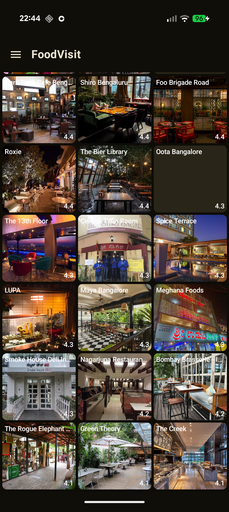
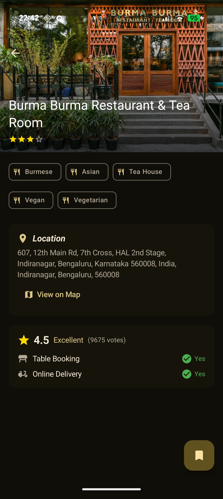
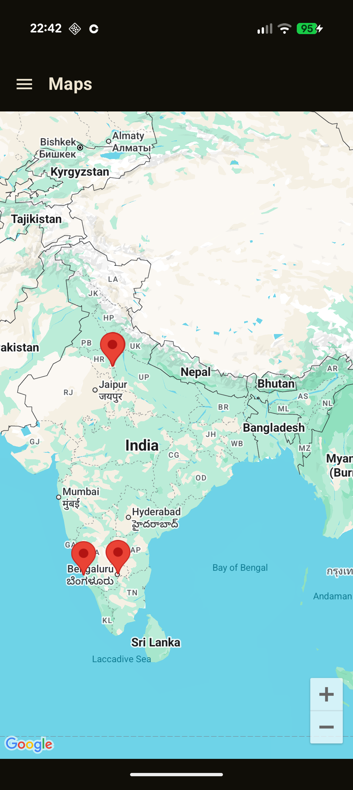
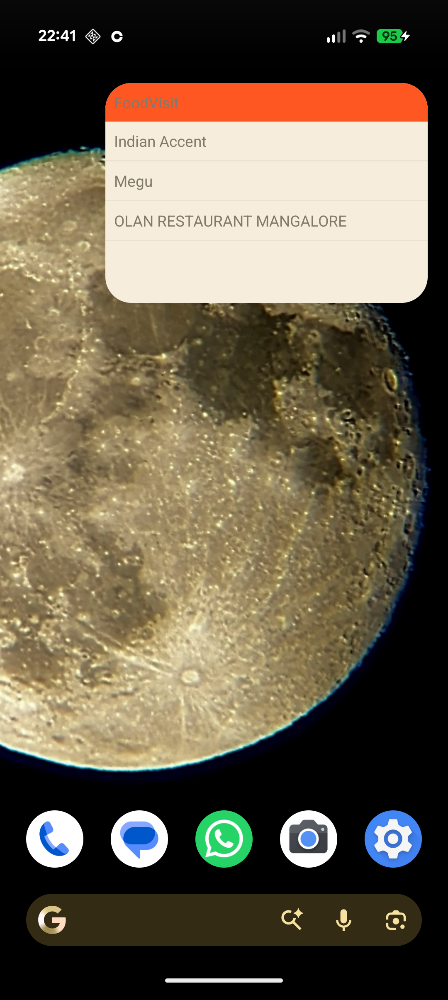
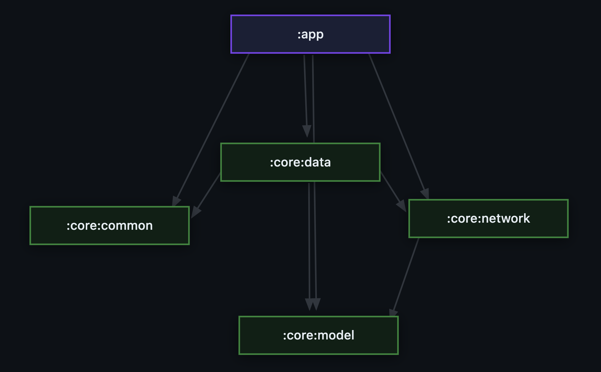

# FoodVisit 🍔📍

FoodVisit is a modern Android application designed for food enthusiasts to discover, track, and navigate to restaurants they want to visit. Built with the latest Android development practices, it offers a seamless, offline-first experience.

## ✨ Features

- **🔍 Restaurant Discovery**: Explore top-rated restaurants in your city using real-time data from the Google Places API.
- **💾 Offline-First Experience**: Cached restaurant data allows you to browse even when you're offline.
- **📌 "To Visit" Wishlist**: Curate your personal list of must-visit restaurants with a single tap.
- **🗺️ Interactive Map**: Visualize all your wishlisted spots on an integrated Google Map.
- **📱 Home Screen Widget**: Keep your wishlist front and center with a convenient home screen widget.
- **🚀 Deep Linking**: Launch directly into restaurant details from the home screen widget.
- **💎 Product Flavors**: Supports both `free` (Ad-supported) and `paid` (Ad-free) versions.

## 📸 Screenshots

| Home Screen | Restaurant Details | Map View | Home Widget |
| :---: | :---: | :---: | :---: |
|  |  |  |  |

## 🏗️ Architecture

FoodVisit follows the **recommended Android Architecture** patterns, ensuring scalability, maintainability, and testability.



### Key Architectural Pillars
- **MVVM (Model-View-ViewModel)**: Separates the UI from the business logic.
- **UDF (Unidirectional Data Flow)**: Ensures a single source of truth for the UI state using `StateFlow`.
- **Repository Pattern**: Orchestrates data flow between multiple sources (Network and Local Database).
- **Clean Architecture Principles**: Organized into clear layers (Data, UI, DI).

### Data Flow (Offline-First)
1. **Network**: Fetches restaurant data using **Retrofit** from the **Google Places API**.
2. **Local**: Persists data in a **Room** database (`foodvisit.db`) for offline access.
3. **Cache Policy**: Implements a 30-minute TTL (Time-To-Live) for cached restaurant data.
4. **Wishlist Persistence**: User-saved "To Visit" restaurants are preserved even when the main cache is refreshed.

### Tech Stack
- **UI**: [Jetpack Compose](https://developer.android.com/jetpack/compose) for modern, declarative UI.
- **Dependency Injection**: [Hilt](https://developer.android.com/training/dependency-injection/hilt-android) for robust DI.
- **Networking**: [Retrofit](https://square.github.io/retrofit/) & [OkHttp](https://square.github.io/okhttp/).
- **Database**: [Room](https://developer.android.com/training/data-storage/room) for local persistence.
- **Concurrency**: [Kotlin Coroutines](https://kotlinlang.org/docs/coroutines-overview.html) and [Flow](https://kotlinlang.org/docs/flow.html).
- **Navigation**: [Navigation Compose](https://developer.android.com/jetpack/compose/navigation).
- **Ads**: [Google AdMob](https://developers.google.com/admob/android/quick-start) (Free flavor only).

## 🚀 Getting Started

### Prerequisites
- Android Studio Ladybug (or newer)
- JDK 17
- A Google Cloud Project with **Maps SDK for Android** and **Places API (New)** enabled.

### Setup
1. Clone the repository: `git clone https://github.com/kartikprabhu20/FoodVisit.git`
2. Add your **Google Maps API Key** to `app/src/main/AndroidManifest.xml`:
   ```xml
   <meta-data
       android:name="com.google.android.geo.API_KEY"
       android:value="YOUR_API_KEY"/>
   ```
3. Sync Gradle and build the project.

### Build Commands
```bash
./gradlew assemblePaidDebug   # Build Paid flavor debug APK
./gradlew assembleFreeDebug   # Build Free flavor debug APK
./gradlew test                # Run unit tests
```

